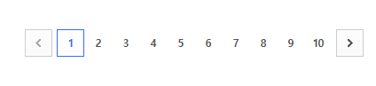

# syncly-software-engineer-intern

싱클리 소프트웨어 인턴 과제

## 📋 기능

- 여러 상품의 리뷰를 동시에 수집
- 각 상품당 최대 1,500개 리뷰 수집 (15페이지 × 10개)
- Oxylabs Residential Proxy 사용으로 IP 차단 방지
- 요청 간 지연 시간 설정 (기본 5초)
- 엑셀 파일로 결과 저장
- 각 제품별 요청을 별도로 실행 (Promise.all 이용)
- 테스트 코드 작성

## 실행 환경

Node.js

## 실행 방법

```bash
# 설치
npm install

# 크롤링 실행 방법
npm run dev

# 테스트 코드 실행 방법
npm run test
```

## 결과 파일

- `output/` 디렉토리에 엑셀 파일이 생성된다.
- 파일명: `coupang_reviews_YYYY-MM-DDTHH-MM-SS.xlsx`
- 전체 리뷰 시트와 각 상품별 시트가 포함된다.

## 참고 사항

각 리뷰가 끝난 이후에는 5000ms의 delay를 주어 limit rate로 인한 IP 밴을 방지

제품 당 최대 150 페이지이므로 제품 당 최대 소요시간은 12.5분이 소요된다.

각 페이지의 size를 10으로 결정한 이유 <br>
-> 쿠팡 사이트에서 리뷰를 확인하는 경우 리뷰가 10개씩 보여지는 페이지네이션 방식으로 구현되어 있음



-> 따라서, 유저가 사이트를 방문할 때와 최대한 유사한 방식으로 접근하는 것이 좋다고 판단하여 10으로 결정하였음

### 변경 사항

- 조정한 요구사항: options의 타입을 문자열 배열에서 문자열로 변경
- 조정 이유: 원래는 options의 타입을 문자열 배열로 설정했으나 excel에 options의 값이 표기가 되지 않아 문자열로 변경하였습니다
- 대안: 배열에서 문자열로 타입을 변경

### HTTP 522 에러

cloudflare에서 발생하는 connection timed out 에러로 웹 서버에 대한 TCP 연결을 설정할 수 없을 때 발생한다. 크롤링을 시도할 때 30~40번에 한 번씩 간헐적으로 발생하고 있다. 발생 원인은 파악하지 못하였음

- 의문점: 요청 횟수가 일정 횟수를 넘어가면 요청이 완전히 막히는 방식이 아니고 간헐적으로 요청이 실패하는 이유를 모르겠음

### 병렬 처리

각 제품별 크롤링 함수를 만들고 `Promise.all` 함수를 사용하여 개별적으로 실행시킨다. 제품의 갯수가 많아지더라도 전체 실행 시간이 길어지지 않는다.

### IP Proxy

처음에는 IP Proxy가 없어도 된다고 판단하여 없이 구현하였으나 요청의 갯수가 많아지면 500 에러가 종종 발생하는 상황을 맞닥뜨려 IP Proxy을 도입하게 되었음
